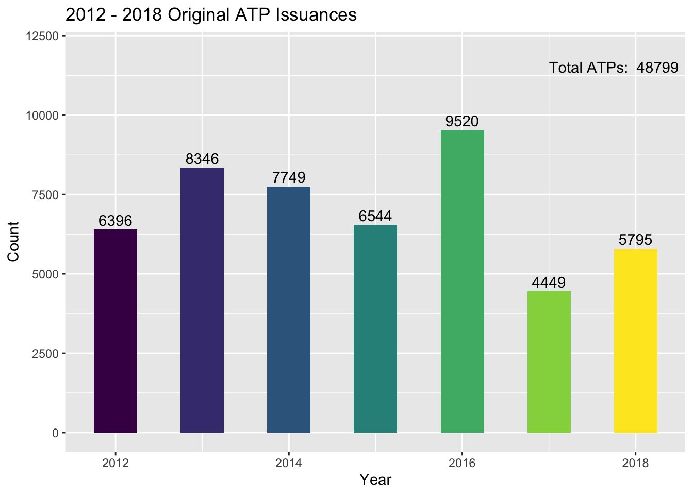

FAA ATP Issuances, 2012-2017
================
Matthew Hull
2018-08-07

``` r
library(readxl)
library(ggplot2)
```

``` r
# bring in from original data files:
yrs <- as.character(seq(2012,2017,1))


if(!dir.exists("airmandata")) {
  dir.create("airmandata")  
}


for (y in yrs){
  url <- paste("https://www.faa.gov/data_research/aviation_data_statistics/civil_airmen_statistics/media/",y,"-civil-airmen-stats.xlsx",sep="")
  destfile <- paste("airmandata/",y,"airmandata.xlsx",sep="")
  download.file(url, destfile)
}

airman_files <- dir(path="airmandata",pattern="*.xlsx")
```

``` r
df <- data.frame( matrix(c(yrs,rep(NA,length(yrs))), nrow=length(yrs), ncol=2) )
colnames(df) <- c("year", "atps")
df$atps <- as.numeric(df$atps)
df$year <- as.numeric(as.character(df$year))

for (a in airman_files) {
  yr <- substr(a,1,4)
  fn <- paste("airmandata/",a,sep="")
  d <- read_excel( fn
                   , sheet = "Table 16"
                   , col_types = c("text", "skip", "text", "skip", "skip", "skip", "skip", "skip", "skip", "skip"))
  
  cnames <- d$`Table 16`
  d <- as.data.frame(t(d$X__1))
  colnames(d) <- cnames
  atp_total <- as.numeric(as.character(d$`Airline Transport`))
  idx <- which(df$year==as.numeric(yr))
  df$atps[idx] <- atp_total
  
}
```

``` r
ggplot(df, aes(x=year,y=atps)) +
  geom_bar(stat="identity", aes(fill=year), show.legend = F, width=.5) +
  ylim(0, max(df$atps)+2500) +
  annotate("text"
           ,label=df$atps
           ,x=df$year
           ,y=df$atps+300) +
  annotate("text"
           ,label=paste("Total ATPs: ",sum(df$atps))
           , x=max(df$year)-.25
           , y=max(df$atps)+2000) +
  xlab("Year") +
  ylab("Count") +
  ggtitle("2012-2017 Original ATP Issuances")
```


